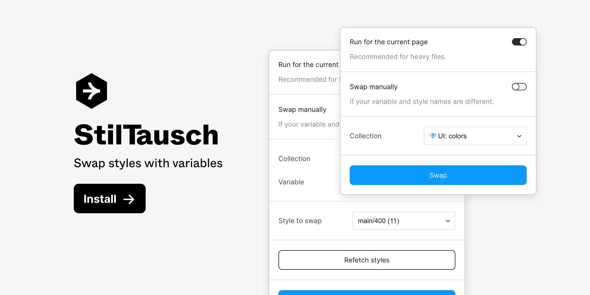
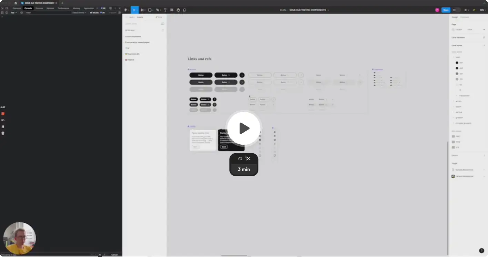
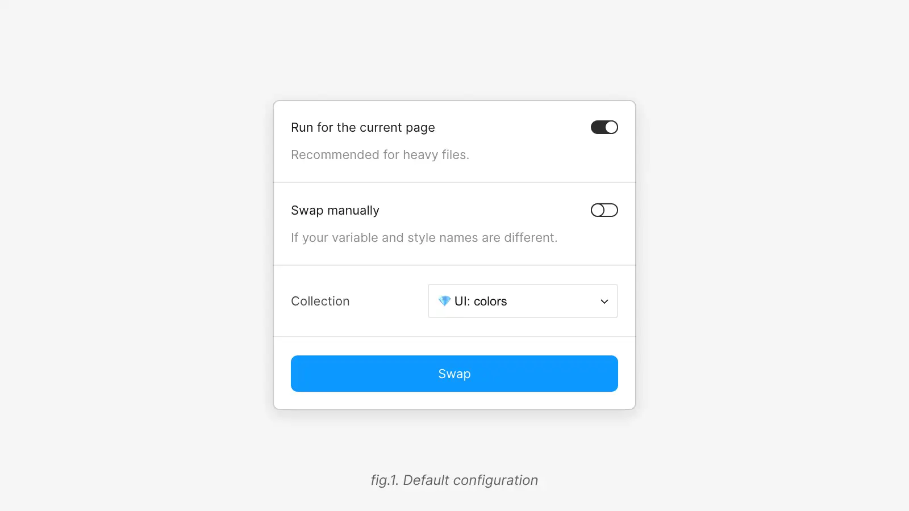
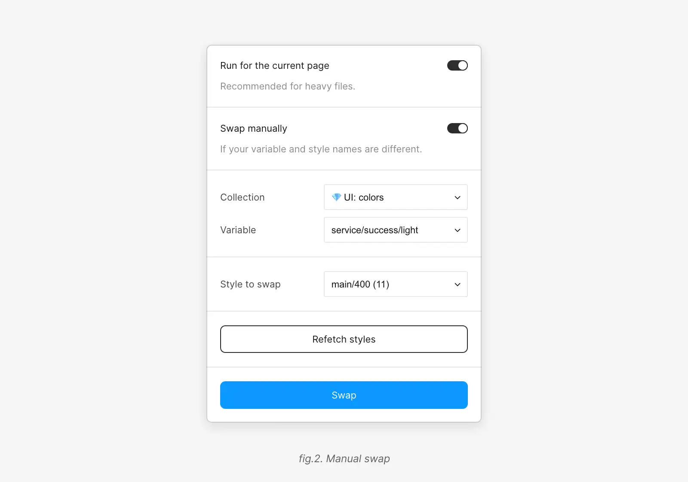
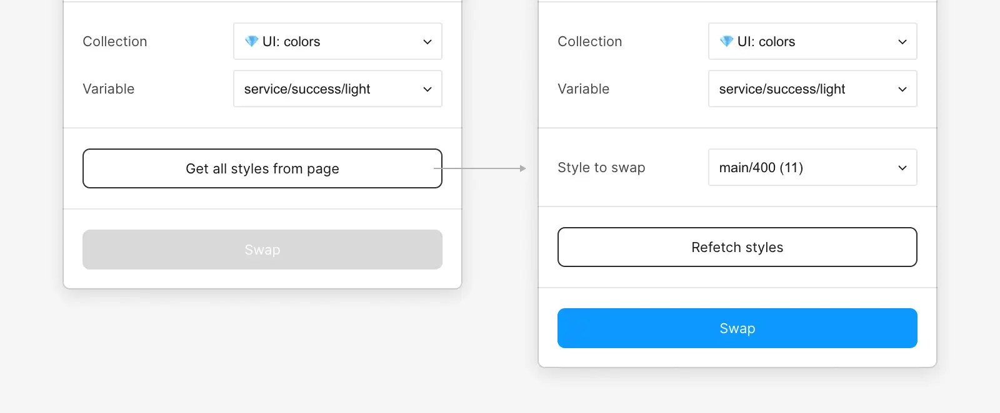
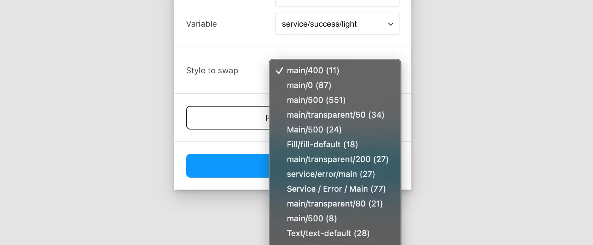

# StilTausch ✷ Swap Styles with Variables

StilTausch is a Figma plugin that allows you to swap styles with variables.

### ⚠️ Restrictions

1. This plugin works only with team libraries, which means you need to publish your library before you can swap styles.
2. The plugin swaps only color styles.
3. Doesn't swap styles on INSTANCE components.

---

### Video demo (click to open)

---

## Basics

### Run for the current page

It's on by default. The plugin will swap styles within the current page only. It's recommended for heavy files. In this case, the plugin will run faster. But if you want to swap styles in the whole file, you can turn this option off, which can be a bit slower.

### Swap manually

It's off by default. The default behavior is to swap all styles.

The plugin will swap styles with variables if they have the same name. For example, if you have a style named `Button/Primary/Default` and a variable named `Button/Primary/Default`, the plugin will swap the style with the variable.

But if you want to swap styles manually, style by style, you can turn this option on. It could be helpful if style and variable names are different.

### "Collection" select

Before you can swap styles, you need to select a collection. The plugin will swap styles only within the selected collection. The plugin will filter out collections that don't have any color styles.

---

If you switch on the `Swap manually` option, there will be new options available.

### "Variable" select

With this option, you can select a variable that you want to swap with. The plugin will swap styles with the selected variable. All variables fetched from the selected collection.

### "Style to swap" select

Before you can select a style to swap, you need to fetch styles. The plugin doesn't fetch styles automatically because it can be slow if the file or a page is heavy.

After you click the `Get all styles` button, the plugin will fetch styles from the page or file (depends on the `Run for the current page` option).

### "Refetch styles" button

If you want to fetch styles again, you can click the `Refetch styles` button. It could be helpful if you added new styles to the page or file or canceled the previous plugin run.

---

## Feedback

If you have any questions or suggestions, feel free to leave a comment on the [plugin page](https://www.figma.com/community/plugin/1265414931203814032) or [create an issue](https://github.com/PavelLaptev/StilTausch-Swap-styles-with-variables/issues) on GitHub.
